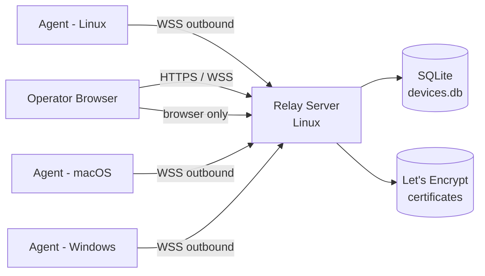
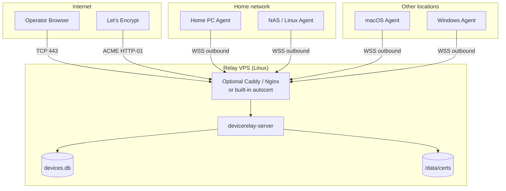
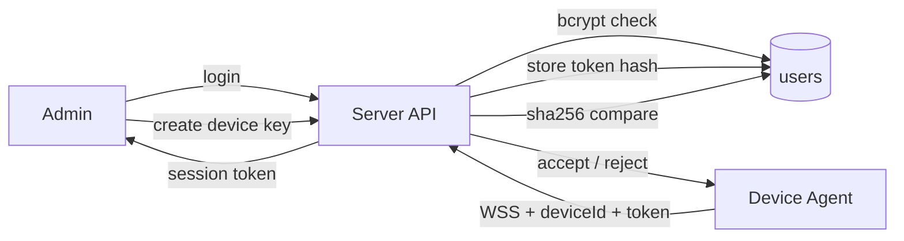
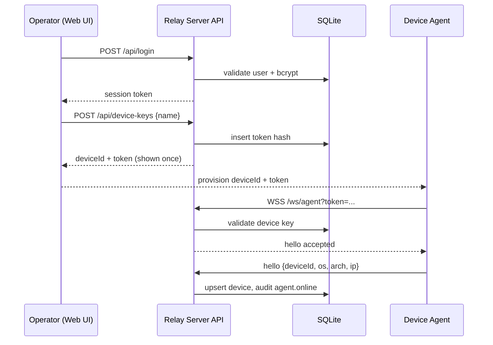
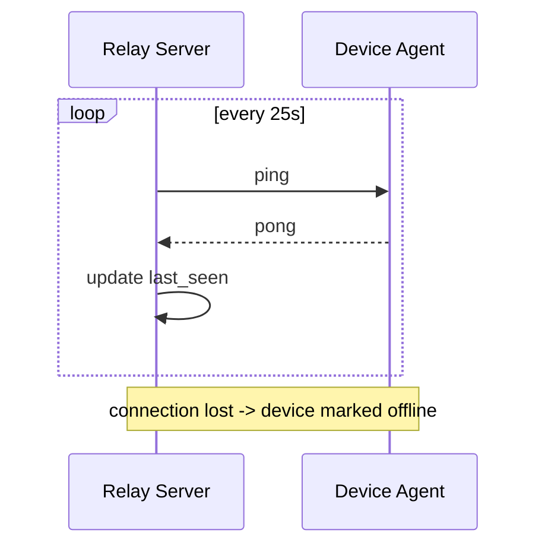
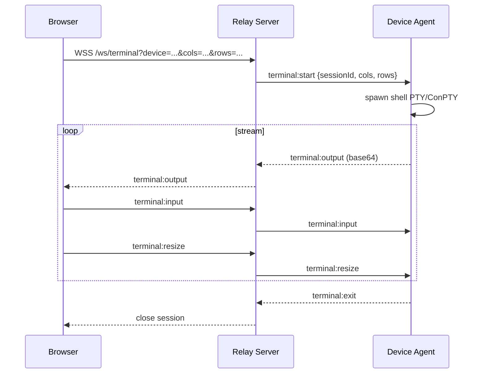
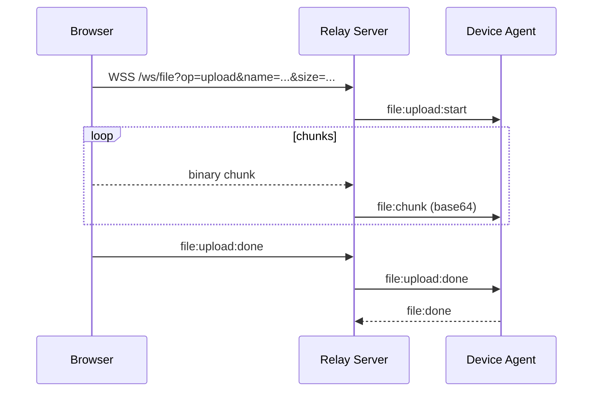
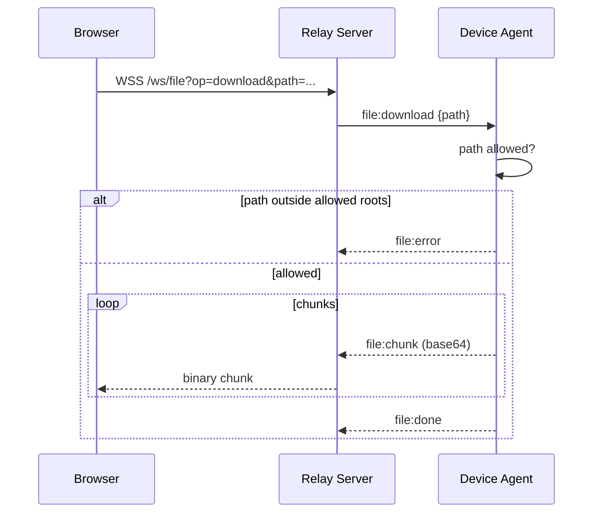
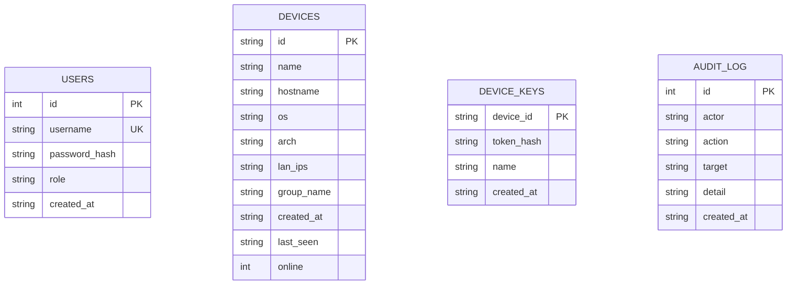

# Device Relay Architecture

Device Relay is a self-hosted control plane for a fleet of devices behind NAT.
It combines a Linux relay server, outbound device agents and a browser-based
management console. This document describes the design so the project can be
understood, extended and audited without reading every source file.

## 1. Design Goals

- Devices without public IPs can be reached from anywhere through one relay.
- The operator only needs a browser; no VPN or remote client is installed on
  the operator machine.
- Agents connect outbound, so no inbound firewall rules or port forwarding are
  required on the managed devices.
- The control plane is self-hosted, persists state in SQLite and keeps an
  audit trail of security-relevant actions.
- The server targets Linux with no CGO dependency; agents run on Linux, macOS
  and Windows.

## 2. Component Overview



The three binaries are:

| Binary | Platform | Responsibility |
| --- | --- | --- |
| `devicerelay-server` | Linux | HTTP API, WebSocket relay, static web UI, SQLite persistence, Let's Encrypt |
| `devicerelay-agent` | Windows / macOS / Linux | Outbound registration, heartbeat, PTY/ConPTY terminal, file transfer |
| Web UI | embedded into server | Dashboard, device management, terminal, file transfer, device keys |

## 3. Deployment



Recommended deployment:

```bash
./bin/devicerelay-server \
  -domain relay.example.com \
  -acme-email you@example.com \
  -data-dir /var/lib/device-relay
```

TCP 80 and 443 must be open. The server redirects HTTP to HTTPS and
automatically renews certificates.

## 4. Authentication and Access Model



There are two credential paths:

1. Operator sessions: username/password is checked with bcrypt and produces a
   24-hour session token. The legacy static `ADMIN_TOKEN` still works.
2. Device credentials: each device gets a unique key. The plaintext token is
   returned once at creation and only its SHA-256 hash is stored. Agents that
   use the legacy shared `DEVICE_TOKEN` are still accepted for migration, but
   new devices should always use per-device keys.

## 5. Device Registration Sequence



## 6. Keepalive



On server restart, all devices start offline. The first valid hello from an
agent brings the device back online, so liveness never lies.

## 7. Remote Terminal

The browser never talks to the device directly. The server forwards a
WebSocket session to the agent, which runs a real PTY (Unix) or ConPTY
(Windows) shell.



Terminal output is base64 encoded because PTY output is not guaranteed to be
valid UTF-8. Browser input is sent as JSON text and written to the PTY as
bytes.

## 8. File Transfer

Upload direction:



Download direction:



The agent rejects paths outside its configured roots (home directory by
default), so a compromised web session cannot read arbitrary server files.

## 9. Data Model



Operator sessions are kept in server memory with a 24-hour expiry. Everything
else is persisted in `devices.db`.

## 10. Protocol

All control traffic is JSON over WebSocket. The envelope is:

```json
{
  "type": "terminal:output",
  "sessionId": "...",
  "data": "base64..."
}
```

| Type | Direction | Purpose |
| --- | --- | --- |
| `hello` | agent -> server | register device metadata |
| `ping` / `pong` | both | keepalive |
| `terminal:start` | server -> agent | open a shell session |
| `terminal:output` | agent -> server -> browser | PTY/ConPTY output |
| `terminal:input` | browser -> server -> agent | keystrokes |
| `terminal:resize` | browser -> server -> agent | window resize |
| `terminal:stop` / `terminal:exit` | both | end a session |
| `file:upload:start` | server -> agent | begin upload |
| `file:chunk` | both | base64 payload |
| `file:upload:done` / `file:done` / `file:error` | both | finish or fail |
| `file:download` | server -> agent | read a device path |

## 11. Security Properties

- Operator and device credentials are separated.
- Device tokens are stored as SHA-256 hashes and shown once at creation.
- WebSocket connections validate the `Origin` header for browsers.
- Failed authentication and security-relevant actions are recorded in the
  audit log.
- File downloads are constrained to allowed paths.
- HTTPS is provided by automatic Let's Encrypt, manual certificates or a
  reverse proxy.
- Default deployment does not expose plain HTTP beyond localhost.

## 12. Directory Layout

```text
cmd/server/            server entrypoint (HTTP, HTTPS/ACME)
cmd/agent/             agent entrypoint (CLI flags)
internal/server/       API, WebSocket relay, SQLite registry
internal/agent/        outbound agent, terminal sessions, file transfer
internal/protocol/     shared JSON message types
web/                   React + TypeScript console (embedded into server)
docs/architecture.md   this document
```

## 13. Extension Points

- Device-to-device TCP port forwarding through the relay.
- Remote desktop via an agent-side screen streaming endpoint.
- User roles and per-device access policies.
- Power actions (reboot, shutdown) and agent updates.
- Persistent session recording for audit replay.
